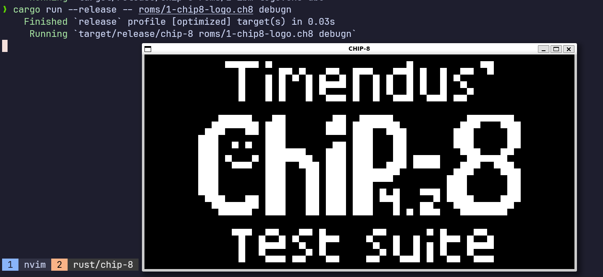

# CHIP-8 Emulator

A CHIP-8 emulator written in Rust using SDL2.

This project implements the CHIP-8 virtual machine, including graphics, input, and sound. It can run classic CHIP-8 ROMs and test programs.

---

## About CHIP-8

CHIP-8 is a simple interpreted programming language used to build early video games. Writing a CHIP-8 emulator is a common project for learning emulation, CPU design, and low-level systems programming.

---

## Features

* Full CHIP-8 instruction set
* 4096 bytes of memory
* 64×32 monochrome display
* Keyboard input support
* Sound (beep) timer
* Configurable execution loop
* Includes test ROMs

---

## Getting Started

### Prerequisites

* Rust (latest stable)
* SDL2 development libraries

On Ubuntu:

```bash
sudo apt install libsdl2-dev
```

---

### Build

```bash
cargo build --release
```

---

### Run

```bash
cargo run --release -- <path_to_rom> [debug]
```

Example:

```bash
cargo run --release -- roms/1-chip8-logo.ch8 debugn
```

If the second command line argument is exactly `debug` then you can run the CPU one instruction at a time for with debug information printed on the screen.

---

## ROMs

The repository includes several test ROMs in the `roms/` directory:

* `1-chip8-logo.ch8` – Basic rendering test
* `2-ibm-logo.ch8` – Classic IBM logo
* `3-corax+.ch8` – Instruction test suite
* `4-flags.ch8` – Graphics test
* `5-quirks.ch8` – Edge cases and quirks
* `6-keypad.ch8` – Input handling
* `7-beep.ch8` – Sound test
* `8-scrolling.ch8` – Scrolling behavior

---

## Project Structure

```
├── roms/          # Test ROMs
├── src/
│   ├── chip8.rs  # Core CHIP-8 implementation
│   ├── emulator.rs
│   ├── lib.rs
│   └── main.rs   # Entry point
```

---

## Controls

The emulator maps CHIP-8 keys to your keyboard:

```
1 2 3 4      →  1 2 3 C
Q W E R      →  4 5 6 D
A S D F      →  7 8 9 E
Z X C V      →  A 0 B F
```

---

## Notes

* Timing and quirks follow a common modern interpretation of CHIP-8.
* Some ROMs rely on specific quirks; behavior may vary slightly.

---

## Demo



---